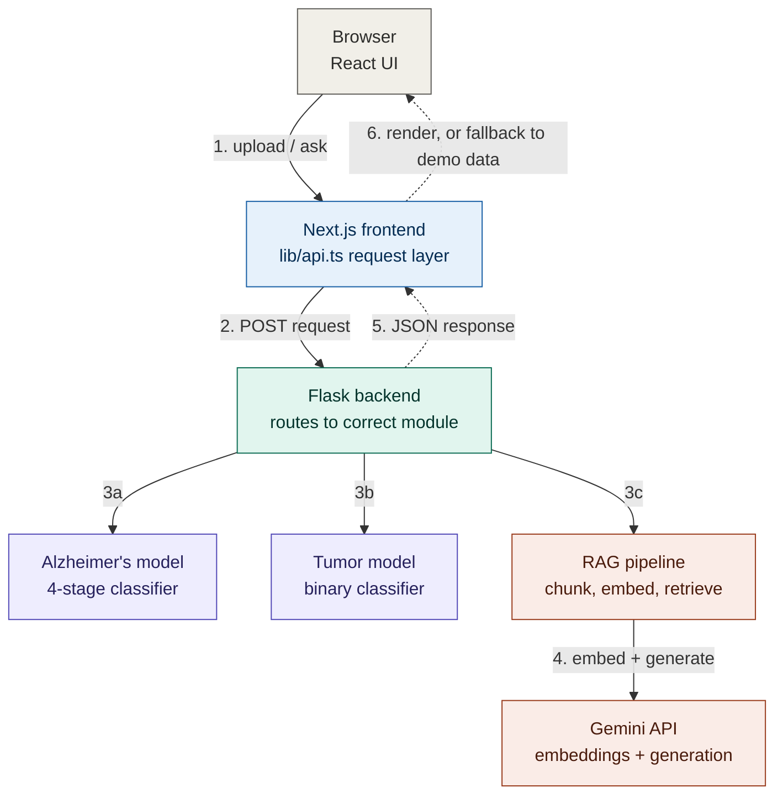

# IntelliMed — Predictive Medical Intelligence System

IntelliMed is a web-based medical AI platform that helps with early detection of neurological conditions and helps patients understand their diagnosis reports through natural conversation. It brings together deep learning image classification and retrieval-augmented generation (RAG) in one cohesive application.

The platform has three modules, all sharing the same frontend and backend:

1. **Alzheimer's Disease Classification** — upload a brain MRI, get a 4-stage cognitive assessment
2. **Brain Tumor Detection** — upload a brain MRI, get a yes/no tumor result
3. **Report Intelligence** — upload a diagnosis report, chat with it in plain language

> **Disclaimer**: This is an assistive research/educational tool. Every prediction is AI-generated and must be verified by a qualified medical professional. It is not a substitute for clinical diagnosis.

---

## Table of Contents

- [What This Application Does](#what-this-application-does)
- [Application Architecture](#application-architecture)
- [Module 1 — Alzheimer's Detection](#module-1--alzheimers-detection)
- [Module 2 — Brain Tumor Detection](#module-2--brain-tumor-detection)
- [Module 3 — Report Intelligence (RAG)](#module-3--report-intelligence-rag)
- [Frontend Design](#frontend-design)
- [Backend Design](#backend-design)
- [API Reference](#api-reference)
- [Tech Stack](#tech-stack)
- [Repository Structure](#repository-structure)
- [Getting Started](#getting-started)
- [Cloud Deployment](#cloud-deployment)
- [Performance](#performance)
- [Security Notes](#security-notes)
- [Roadmap](#roadmap)

---

## What This Application Does

A patient or clinician visits the site and picks one of three tools. Each tool is a self-contained page that talks to the same Flask backend over a small, well-defined REST API.

- On the **Alzheimer's** and **Brain Tumor** pages, the user drags in an MRI image. The image is sent to the backend, run through a trained model, and the result — a class label plus a confidence score — comes back and is rendered as a clear result card.
- On the **Report Intelligence** page, the user uploads a document (a lab report, a discharge summary, a radiology report — anything readable). The backend extracts the text, indexes it into a vector store, and the user can then ask questions about it in a chat interface. Every answer is generated by an LLM but constrained to only use information actually present in the uploaded document.

The whole system is designed around one guiding rule: **if any part of the backend is unavailable — the model file is missing, the server is down, the network drops — the frontend never breaks.** It falls back to realistic sample data and clearly labels it as a demo response, so the interface always stays usable.

---

## Application Architecture

This section describes how the **application itself** is structured — the flow of a request from the browser through the frontend, into the backend, through the model or RAG pipeline, and back. Cloud hosting and infrastructure are described separately in [Cloud Deployment](#cloud-deployment).

### Request Flow



**Reading the diagram**: solid arrows are the request path down through the system; dashed arrows are the response path back up. If step 5 fails for any reason (backend down, timeout, error), step 6 substitutes local fallback data instead of breaking the UI.

### Why This Design

- **Decoupled frontend/backend** — the frontend is a pure API consumer. It never touches a model file or a vector store directly. This means the backend can be redeployed, scaled, or swapped without touching a single line of frontend code.
- **Fallback-first frontend** — every API call in `lib/api.ts` is wrapped so that a failure (timeout, 500 error, network drop) returns realistic dummy data instead of an error screen. The user always sees a complete, working UI.
- **Model-agnostic backend** — the model loaders accept either `.keras` or `.pickle` files. Swapping a model is a matter of dropping a new file into `model_weights/` and restarting — no code changes.
- **Pluggable vector store** — the RAG pipeline can run on in-memory FAISS, local-disk ChromaDB, or a remotely hosted ChromaDB instance, selected purely through an environment variable.

---

## Module 1 — Alzheimer's Detection

**What it does**: Classifies a brain MRI scan into one of four clinically recognized stages of cognitive decline.

**Classes returned by the model** (exact strings):
- `NonDemented`
- `VeryMildDemented`
- `MildDemented`
- `ModerateDemented`

**How it works end-to-end**:

1. User drags an MRI image (PNG/JPG/TIFF/BMP) onto the upload zone
2. The image is validated (checked that it's a real, non-corrupted image) and sent as `multipart/form-data` to `POST /api/alzheimer/predict`
3. The backend preprocesses the image: resize to 224×224, normalize pixel values to [0,1], add a batch dimension
4. The image tensor is passed through a ResNet-50-based classifier (transfer learning from ImageNet weights, fine-tuned on labeled MRI data)
5. The model outputs a softmax probability distribution across the 4 classes
6. The backend picks the highest-probability class as the prediction, packages all 4 scores into a breakdown array, and returns everything as JSON
7. The frontend renders: the predicted stage name, a large confidence percentage, a 4-stage progress strip showing where this result falls on the severity scale, a full confidence breakdown bar chart across all classes, and a clinical recommendation appropriate to that stage

**If the model file is missing** (e.g., during development before weights are trained), the backend returns a structurally identical response with randomized-but-plausible probabilities and an `is_dummy: true` flag, so the UI can be built and tested independently of having a trained model.

---

## Module 2 — Brain Tumor Detection

**What it does**: Runs a binary classification on a brain MRI to determine whether a tumor is present.

**How it works end-to-end**:

1. User uploads a brain MRI (same accepted formats as the Alzheimer's module)
2. Sent to `POST /api/brain-tumor/predict`
3. Backend preprocesses the image the same way (resize, normalize, batch)
4. An EfficientNet-B4-based binary classifier outputs a single probability of "tumor present"
5. If that probability crosses 0.5, `detected: true` is returned along with a confidence score (how far the probability sits from the 50% decision boundary, scaled to 0–100)
6. The frontend shows a large, unambiguous verdict card — a checkmark for "no tumor" or an alert icon for "tumor detected" — followed by a confidence gauge and a clinical note explaining what the result means and what to do next

This module is intentionally kept simple on the output side (just yes/no + confidence) because a binary screening result is what's clinically useful at this stage — more detailed characterization (tumor type, grade, location) requires radiologist review and isn't something a single binary classifier should claim to determine.

---

## Module 3 — Report Intelligence (RAG)

**What it does**: Lets a patient upload their diagnosis report and ask questions about it in plain English, with answers generated only from the content of that specific document.

**How it works end-to-end**:

### Upload phase

1. User uploads a document — PDF, DOCX, TXT, or an image (which gets OCR'd)
2. Sent to `POST /api/rag/upload`
3. The backend extracts plain text:
   - **PDF**: text layer extracted directly via PyMuPDF; if a page has no text layer (i.e., it's a scanned image), that page is rendered at 200 DPI and passed through Tesseract OCR instead
   - **DOCX**: paragraphs extracted via python-docx
   - **Images**: passed directly through Tesseract OCR
4. The extracted text is split into overlapping chunks (~800 characters each, 150-character overlap) using a recursive splitter that tries to break on paragraph boundaries first, then sentences, then words — so chunks stay semantically coherent
5. Each chunk is embedded into a 768-dimensional vector using Gemini's `text-embedding-004` model
6. The vectors are stored in a vector index (FAISS, local ChromaDB, or Azure-hosted ChromaDB — see [Backend Design](#backend-design))
7. A `session_id` is generated and returned to the frontend, along with how many chunks were indexed

### Query phase

1. User types a question in the chat interface
2. Sent to `POST /api/rag/query` along with the `session_id`
3. The backend embeds the question using the same embedding model
4. It performs a similarity search against the stored vectors for that session, retrieving the 5 most relevant chunks
5. Those chunks are assembled into a context block and inserted into a prompt template that instructs the model to answer **only** using that context, to explain medical terms in plain language, and to always recommend consulting a doctor for treatment decisions
6. The prompt is sent to Gemini `2.0-flash`, and the generated answer is returned to the frontend
7. The frontend renders it as a chat bubble, with support for basic markdown-style formatting (bold text, bullet points)

### Why RAG instead of just asking the LLM directly

Feeding a general-purpose LLM a question about a specific patient's report without grounding it in that document risks the model hallucinating plausible-sounding but incorrect medical information. By restricting the model to only use retrieved chunks from the actual uploaded document, answers stay factually tied to what's really in the report — and if something isn't in there, the model is instructed to say so rather than invent an answer.

---

## Frontend Design

The frontend is a Next.js 14 application using the App Router, written in TypeScript.

**Design language**: a dark, clinical-technical aesthetic — deep navy backgrounds, cyan/teal accents for primary actions, amber for warnings and recommendations, red for alerts, violet for the RAG module. Typography uses Syne (bold display headings), DM Sans (body text), and JetBrains Mono (technical labels, confidence percentages, timestamps).

**Key architectural pieces**:

- **`lib/api.ts`** — the single point of contact with the backend. Every function here (`predictAlzheimer`, `predictTumor`, `ragUpload`, `ragQuery`) follows the same pattern: try the real backend with a 15-second timeout, and if that fails for any reason, transparently substitute realistic local fallback data. Every returned object carries a `fromFallback` flag so the UI can show a small "demo mode" notice without disrupting the rest of the experience.
- **`components/UploadZone.tsx`** — a shared drag-and-drop upload component used across the Alzheimer's and Brain Tumor pages, with live image preview and a scanning-line animation while dragging.
- **`components/FallbackBadge.tsx`** — the small amber notice shown whenever a result came from fallback data instead of a real backend call.
- **Per-module pages** (`app/alzheimer`, `app/brain-tumor`, `app/rag`) — each is self-contained, calling its corresponding `lib/api.ts` function and rendering module-specific visualizations (confidence breakdowns, stage strips, chat bubbles).

---

## Backend Design

The backend is a Flask application organized around three concerns: routes, models, and utilities.

**`app/routes/`** — thin HTTP handlers. Each route validates the incoming request, delegates to the relevant model or pipeline, and formats the response. No business logic lives here.

**`app/models/`** — the actual inference and RAG logic:

- `alzheimer_model.py` and `brain_tumor_model.py` follow an identical pattern: a lazily-loaded singleton model, support for both `.keras` and `.pickle` file formats detected by file extension, and a dummy fallback response if the weight file isn't present on disk.
- `rag_pipeline.py` contains the full chunking → embedding → storage → retrieval → generation pipeline described in [Module 3](#module-3--report-intelligence-rag) above. The vector store backend is selected via the `RAG_STORE` environment variable:

  ```
  RAG_STORE=memory        FAISS in-process, zero setup, lost on restart
  RAG_STORE=chroma        ChromaDB persisted to local disk
  RAG_STORE=azure_chroma  ChromaDB reached over HTTP (e.g., hosted on Azure)
  ```

  Switching between these requires no code changes — just the environment variable and, for the Chroma-based options, the corresponding connection details.

**`app/utils/`** — shared helpers: image validation (checking uploaded files are genuine, non-corrupted images before they reach a model), and document text extraction (routing PDFs, DOCX files, and images to the right parser).

---

## API Reference

| Method | Endpoint | Purpose | Response Shape |
|---|---|---|---|
| `POST` | `/api/alzheimer/predict` | Classify an MRI into one of 4 Alzheimer's stages | `{ prediction, confidence, breakdown[4], is_dummy }` |
| `POST` | `/api/brain-tumor/predict` | Binary tumor detection on an MRI | `{ detected, confidence, is_dummy }` |
| `POST` | `/api/rag/upload` | Extract, chunk, and index a diagnosis report | `{ session_id, chunks_indexed }` |
| `POST` | `/api/rag/query` | Ask a question grounded in an uploaded report | `{ answer }` |
| `GET` | `/api/health` | Liveness check — reports whether models and Gemini key are configured | `{ status, models, rag_store, gemini_key_set }` |

All prediction/upload endpoints accept `multipart/form-data`. The query endpoint accepts `application/json` with `session_id` and `question` fields.

---

## Tech Stack

**Frontend**
- Next.js 14 (App Router), TypeScript
- Custom CSS design system (no component library dependency)
- Multi-stage Docker build (Node 20 Alpine)

**Backend**
- Flask 3.0, Gunicorn (production WSGI server)
- TensorFlow/Keras and scikit-learn support for model loading
- PyMuPDF, python-docx, Tesseract OCR for document parsing
- FAISS and ChromaDB for vector storage
- Multi-stage Docker build (Python 3.11 slim)

**AI / ML**
- Alzheimer's classifier: ResNet-50 (transfer learning)
- Tumor classifier: EfficientNet-B4
- Embeddings: Gemini `text-embedding-004`
- Generation: Gemini `2.0-flash`

---

## Repository Structure

```
Intellimed/
├── frontend/
│   ├── app/
│   │   ├── page.tsx                 Homepage
│   │   ├── alzheimer/page.tsx       Alzheimer's module UI
│   │   ├── brain-tumor/page.tsx     Tumor detection UI
│   │   ├── rag/page.tsx             Report chat UI
│   │   └── globals.css              Design system
│   ├── components/                  Shared UI components
│   ├── lib/api.ts                   Backend API layer with fallback logic
│   ├── Dockerfile
│   └── next.config.ts               API proxy rewrites
│
├── backend/
│   └── intellimed-backend-v2/
│       └── intellimed-backend-v2/
│           ├── app/
│           │   ├── routes/          API endpoints
│           │   ├── models/          Model loaders + RAG pipeline
│           │   └── utils/           Validators, document parsers
│           ├── model_weights/       .keras / .pickle files (gitignored)
│           ├── requirements.txt
│           ├── Dockerfile
│           └── .env.example
│
└── README.md
```

Infrastructure and cloud deployment code lives in a separate repository: **[github.com/m-vp/Terraform-Code](https://github.com/m-vp/Terraform-Code)**.

---

## Getting Started

### Prerequisites

- Node.js 20+
- Python 3.11+
- A Gemini API key (get one at [aistudio.google.com/app/apikey](https://aistudio.google.com/app/apikey))

### Backend

```bash
cd backend/intellimed-backend-v2/intellimed-backend-v2

cp .env.example .env
# add your GEMINI_API_KEY
# drop model weights into model_weights/ when ready

pip install -r requirements.txt
python run.py
# running on http://localhost:5000
```

### Frontend

```bash
cd frontend

npm install
npm run dev
# running on http://localhost:3000
```

### Verify

```bash
curl http://localhost:5000/api/health
```

---

## Cloud Deployment

Production hosting on Azure — the VNet, subnets, load balancers, VM Scale Sets, and Container Apps environment for ChromaDB — is fully automated with Terraform in a separate repository:

**[github.com/m-vp/Terraform-Code](https://github.com/m-vp/Terraform-Code)**

That repository handles:
- A segmented Azure VNet with isolated subnets for frontend, backend, and the vector database
- Public and internal load balancers
- VM Scale Sets with boot scripts that install Docker, pull this repository, build the images, and run the containers automatically
- A Container Apps environment hosting ChromaDB with persistent Azure File Share storage
- Automatic injection of the ChromaDB connection URL into the backend's environment at boot time

Deployment there is a `terraform init && terraform apply` away — see that repository's README for full details.

---

## Performance

| Task | Mean Latency |
|---|---|
| Alzheimer's classification | ~1.8s |
| Brain tumor detection | ~1.6s |
| RAG query (5-page document) | ~3.8s |

Measured on modest CPU-only compute (2 vCPU, 1 GB RAM). GPU inference would reduce classification latency significantly.

---

## Security Notes

- Uploaded images and documents are processed transiently and are not persisted to disk beyond what's needed for a single inference or indexing operation
- RAG session data lives in memory (or in the configured vector store) keyed by a random session ID — no patient-identifying information is required or stored
- API keys and credentials are never committed to source control — see `.env.example` for what needs to be configured locally
- The frontend never talks to models, vector stores, or Gemini directly — all of that is mediated by the backend, keeping API keys server-side only

---

## Roadmap

- GPU-accelerated inference for faster classification
- Explainability overlays (Grad-CAM) highlighting the regions of an MRI that drove a prediction
- Persistent, expiring RAG sessions (Redis-backed) instead of in-memory only
- User authentication and per-patient history
- CI/CD pipeline for automated build-and-deploy on push
- Native DICOM format support for medical imaging ingestion

---

## Disclaimer

IntelliMed is built for research and educational purposes. All classifications, detections, and RAG-generated answers are produced by AI models and must not be used as a substitute for professional medical diagnosis, advice, or treatment. Always consult a qualified healthcare provider.
